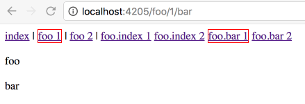

# ember-link-to-active-load



Whilst loading the application for route `/foo/1`, notice that `/foo/2`
is also considered 'active'.

As far as the user is concered, they visited `/foo/1`, _not_ `/foo/2`
so that link should not be active.

This is confusing, as it would not happen on a tradition non-SPA website.

...and even more so because Ember changes its mind once `/foo/1` has loaded,
realises its 'mistake' and makes `/foo/2` not active anymore - creating a flickering
effect.

<b>Hacky fix</b>

```javascript
// application/route.js
actions: {
  didTransition() {
    scheduleOnce('afterRender', this, () => {
      jQuery('.ember-application').addClass('is-loaded');
    });
  }
}
```

```css
// app.scss
.ember-application.is-loaded a.is-active {
  border: 1px solid red;
}
```


<hr>


This README outlines the details of collaborating on this Ember application.
A short introduction of this app could easily go here.

## Prerequisites

You will need the following things properly installed on your computer.

* [Git](https://git-scm.com/)
* [Node.js](https://nodejs.org/) (with NPM)
* [Ember CLI](https://ember-cli.com/)
* [Google Chrome](https://google.com/chrome/)

## Installation

* `git clone <repository-url>` this repository
* `cd ember-link-to-active-load`
* `npm install`

## Running / Development

* `ember serve`
* Visit your app at [http://localhost:4200](http://localhost:4200).
* Visit your tests at [http://localhost:4200/tests](http://localhost:4200/tests).

### Code Generators

Make use of the many generators for code, try `ember help generate` for more details

### Running Tests

* `ember test`
* `ember test --server`

### Building

* `ember build` (development)
* `ember build --environment production` (production)

### Deploying

Specify what it takes to deploy your app.

## Further Reading / Useful Links

* [ember.js](https://emberjs.com/)
* [ember-cli](https://ember-cli.com/)
* Development Browser Extensions
  * [ember inspector for chrome](https://chrome.google.com/webstore/detail/ember-inspector/bmdblncegkenkacieihfhpjfppoconhi)
  * [ember inspector for firefox](https://addons.mozilla.org/en-US/firefox/addon/ember-inspector/)
